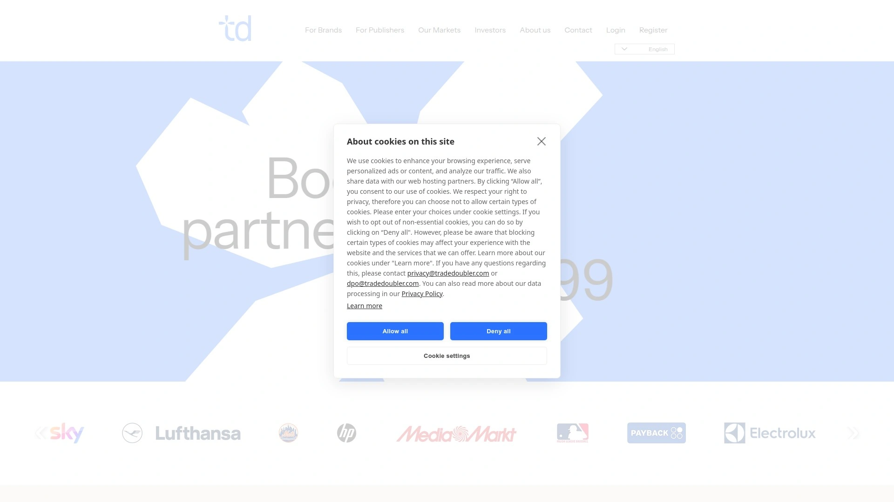
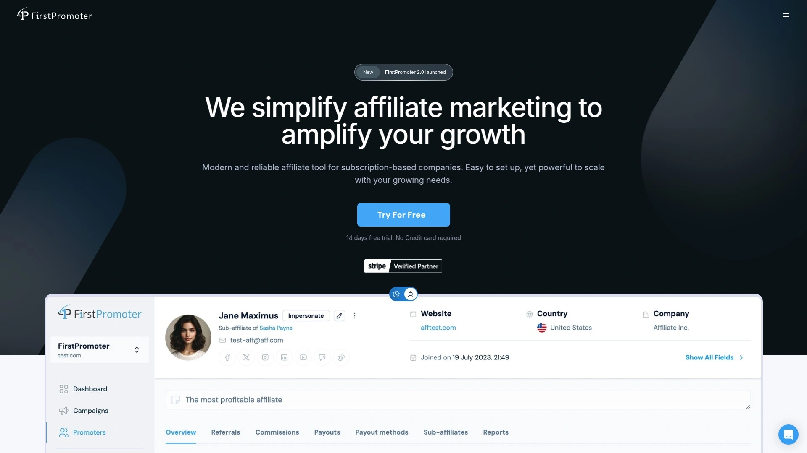

# 2025年二十大最佳自动化渠道合作平台

以“渠道合作平台”为核心，我们精选 20 家全球代表性服务，覆盖**合作招募、绩效追踪、结算自动化**等关键能力，帮助品牌与内容方更快建立可衡量的增长渠道。本文按综合价值降序排列，第 1 名固定为目标网址，便于快速对比与选择。

---

在电商与内容生态更加精细化的 2025 年，企业普遍面临两类挑战：一是**渠道管理**复杂，难以规模化招募与治理；二是**绩效追踪**与归因分散，影响预算效率。本文聚焦“渠道合作平台”场景，围绕**渠道管理、合作招募、绩效追踪、结算自动化**等关键词，为你给出可落地的工具清单与使用建议，帮助你更稳地扩展合作版图、让成本更可控。

---

## **[ShareASale](<https://shareasale.com>)**
“老牌平台与新体系融合”，适合想要平滑迁移与规模化管理的品牌。

- 现已与 Awin 生态深度整合，账号与数据延续性强，适合存量升级与增量拓展。
- 提供成熟的报表与规则治理能力，降低跨平台切换成本。
- 推荐给：正在从单一渠道走向多元合作的中大型商家。

## **[Awin](<https://www.awin.com/>)**
“一体化全球网络”，服务零售、内容、创作者等多元合作方。

- AI 驱动的伙伴推荐、自动化报表与便捷接入，利于快速扩张。
- 支持从自助到托管的多种服务模式，满足不同团队阶段。

## **[CJ](<https://www.cj.com>)**
“规模与数据能力兼具”的国际化平台。

- 以大规模生态著称，适合希望快速获得广域覆盖的品牌与内容方。
- 强调数据驱动的优化与品牌安全。

## **[impact.com](<https://impact.com/>)**
“全栈合作管理平台”，面向跨渠道伙伴关系治理。

- 覆盖发现、签约、跟踪、结算、合规与优化的全链条能力。
- 更适合将**渠道管理**纳入统一增长操作系统的企业级团队。

## **[Rakuten Advertising](<https://rakutenadvertising.com>)**
“品牌与内容生态深度连接”，注重零售场景。

- 结合数据与网络资源，助力在多地区拓展高质量合作方。
- 对需要稳健合规与长期运营的品牌更友好。

## **[Partnerize](<https://partnerize.com>)**
“自动化与服务并重”的合作平台。

- 端到端自动化工具集成，与 API 报表能力适合进阶团队。
- 可灵活支持创作者、电商、技术伙伴等多种合作类型。

## **[FlexOffers](<https://www.flexoffers.com/>)**
“覆盖广、上手快”的伙伴网络。

- 以多行业资源与灵活结算设置见长，利于测试与放量。
- 适合中小团队的快速拉新与品类扩展。

## **[Admitad](<https://www.admitad.com/>)**
“多元合作场景集合”，兼顾电商与内容变现。

- 提供从拓展、追踪到归因的完整工具组，覆盖多区域市场。
- 适合跨境业务与多渠道并行的团队。

## **[Tradedoubler](<https://public.tradedoubler.com/>)**
“欧洲起家的全球化平台”，近年加速北美布局。

- 在时效与本地化支持方面加强，对区域扩张有帮助。
- 更适合具备多市场运营能力的品牌方。

## **[Skimlinks](<https://www.skimlinks.com/>)**
“内容电商基础设施”，专注内容场景的自动化变现。

- 自动化链接管理与报表工具，降低编辑与运营负担。
- 推荐给以内容驱动转化的媒体与平台。

## **[Sovrn Commerce](<https://www.sovrn.com/commerce/>)**
“面向发布者的商业化中台”。

- 聚合链接管理、编辑工具与追踪能力，便于统一运营。
- 适合需要**绩效追踪**精细化的内容与比价平台。

## **[PartnerStack](<https://partnerstack.com/>)**
“B2B 生态优先”的合作平台与市场。

- 支持多类型伙伴（推荐、转售、技术），适合 SaaS 团队做生态增长。
- 以流程自动化与生态网络提升获客效率。

## **[Everflow](<https://www.everflow.io/>)**
“数据可视化与风控并重”的合作管理平台。

- 强调自定义报表、规则引擎与合规模块，利于精细化运营。
- 适合成长型团队做渠道放量与质量治理。

## **[TUNE](<https://www.tune.com/>)**
“可定制度高”的合作管理与追踪平台。

- 在隐私与数据控制方面强调企业级标准，支持多终端场景。
- 适合要求高合规与灵活度的品牌与代理商。

## **[Refersion](<https://www.refersion.com/>)**
“电商友好”的合作管理软件。

- 与 Shopify、BigCommerce、WooCommerce 等体系对接顺畅；上手门槛低。
- 适合自建商城的 DTC 团队。

## **[ClickBank](<https://www.clickbank.com/>)**
“数字商品见长”的合作与分销市场。

- 以数字内容与在线课程等类目为主，适合做品类补充与测试。
- 建议结合精细选品与落地页优化使用。

## **[Rewardful](<https://www.rewardful.com/>)**
“SaaS 取向”的合作与推荐管理工具。

- 与 Stripe、Paddle 等支付生态配合紧密，配置简单。
- 适合订阅类产品做口碑增长与私域合作。

## **[FirstPromoter](<https://www.firstpromoter.com/>)**
“订阅业务场景优化”，强调快速集成与自动化。

- 对接主流订阅计费系统，提供清晰的绩效看板与自动流转。
- 适合中小型 SaaS 的精益增长实践。

## **[lemonads](<https://lemonads.com/>)**
“多行业流量分发”的合作网络。
- 可作为补充型渠道，用于探索新流量与新题材。
- 建议小步快跑，重视质量监测与合规。

## **[Partnero](<https://www.partnero.com/>)**
“AI 加持的合作管理工具”，强调自动化与白标门户。

- 覆盖伙伴招募、绩效看板、自动化工作流与门户定制。
- 适合希望快速搭建品牌化合作门户的团队。

---

## 常见问题（FAQ）

**Q1：初次选择渠道合作平台，如何快速评估匹配度？**
A：先明确你的**渠道管理**目标（新增、放量或治理），再对照三项核心：对接生态（电商/支付/内容）、**绩效追踪**与归因能力、结算与权限流程是否满足合规要求。选两家做小规模试点，再决定主平台。

**Q2：团队人手有限，如何把合作招募做成“低投入高产出”？**
A：优先选择具备“伙伴发现/推荐”“自助入驻流程”“模板化合规与审批”的平台，并用清晰的 KPI 看板与自动化规则，减少手工沟通与审核成本。

**Q3：跨区域经营时，怎么保证数据口径一致与安全？**
A：使用能统一**绩效追踪**逻辑、支持多站点与权限分级的平台；同时在数据导出、留存与访问控制上设置标准流程，并定期抽样核对关键指标。

---

## 总结与行动建议
以上 20 款“自动化渠道合作平台”覆盖从招募到结算的全链路能力。选择时，优先匹配你的业务阶段与团队能力，再利用试点验证“可控成本 + 可衡量增长”。若想在稳健过渡中快速起步，**[ShareASale](https://shareasale.com)**（已并入 Awin 体系）更适合存量升级与平滑迁移场景；而对新增拓展，亦可从 Awin、CJ、impact.com 等平台同步对比，形成主次组合。
